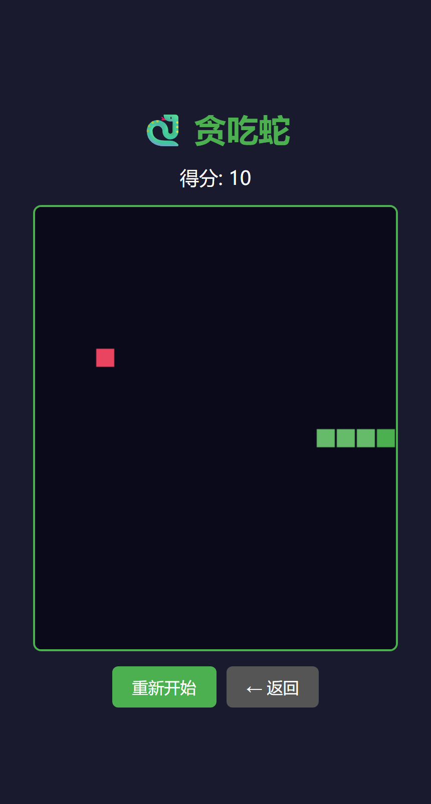
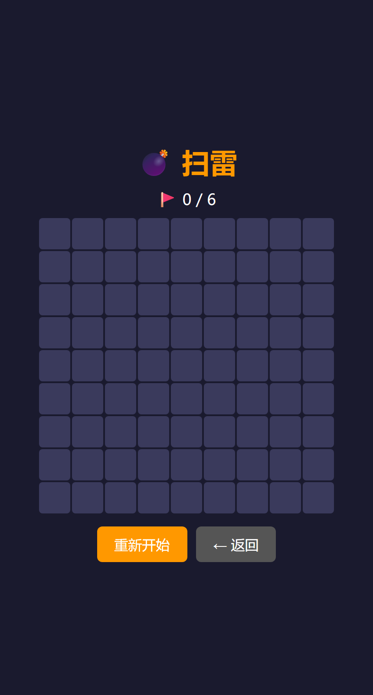
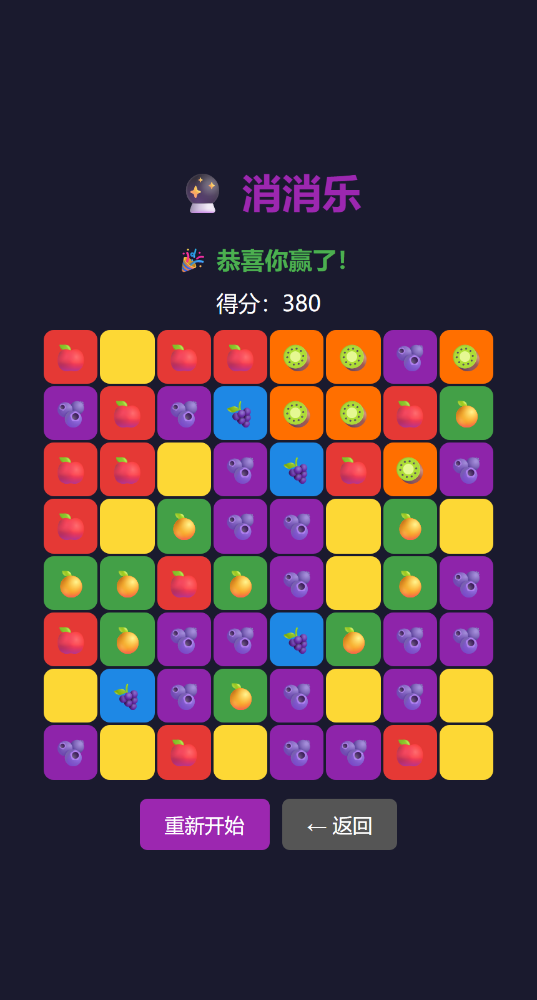
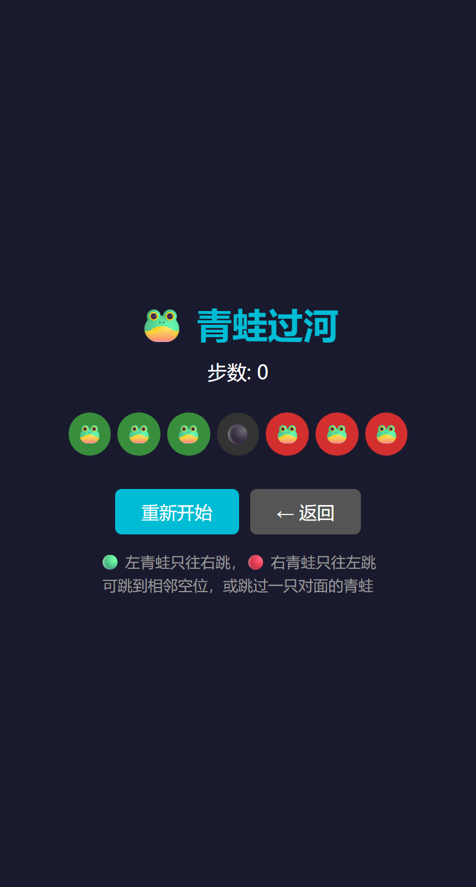
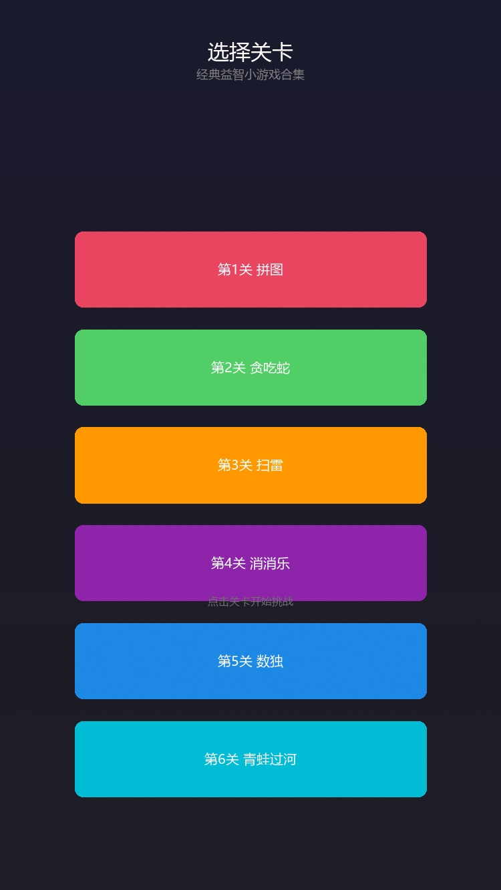

# 🍃 HTML5 应用作品集

**30+ 个零框架依赖的原生 HTML5 / CSS3 / JavaScript 应用与游戏**，桌面与手机浏览器打开即玩即用，托管于 GitHub Pages。

### 🔗 [在线演示（点击进入作品集首页）](https://xinshenghu.github.io/html5/)

> 在线首页提供「卡片式作品集」与「树状浏览器」两种浏览方式；每个项目均为独立静态页面，无构建步骤、无后端依赖。

---

## ✨ 项目亮点

- **零框架 / 零构建**：不依赖 React/Vue/jQuery（个别早期页面除外），不使用打包工具，克隆后任意静态服务器甚至直接双击即可运行
- **自研 Canvas 2D 单文件游戏引擎**：`smallgame` 六关合集共用一套底层（关卡选择 / 计分 / 触屏控制 / 状态重置），并作为微信小游戏上架素材
- **移动端优先的交互设计**：扫雷短按挖雷、长按插旗替代右键；游戏统一竖屏 3:4、安全区适配、触摸事件
- **真实浏览器 API 落地**：MediaRecorder 屏幕录制、getUserMedia、第三方天气 API、LocalStorage 存档
- **完整交付经验**：其中 5 款游戏（扫雷/打地鼠/贪吃蛇/消消乐/青蛙过河）按商业 H5 平台规范独立打包交付（全英文 locale、manifest、图标封面、主包 ≤4MB、禁 eval/iframe 等 20+ 项规范全通过）

## 🧰 技术栈

`HTML5` `CSS3（Flex/Grid/动画/响应式）` `JavaScript ES6+` `Canvas 2D` `MediaRecorder / Web API` `LocalStorage` `GitHub Pages`

## ⭐ 精选代表作

| 项目 | 在线体验 | 技术看点 |
|------|---------|---------|
| 🕹️ 六关小游戏合集 | [体验](娱乐类/games/smallgame/index.html) | 自研 Canvas 2D 引擎、关卡/计分/触屏、单文件可重置状态机 |
| 💣 扫雷 | [体验](娱乐类/games/minesweeper/index.html) | 短按/长按手势区分、竖屏适配、完整重开闭环 |
| 🔮 消消乐 | [体验](娱乐类/games/match3/index.html) | 网格三连匹配、交换消除、下落补充与连锁循环结算 |
| 🐍 贪吃蛇 | [体验](娱乐类/games/snake/index.html) | setInterval 游戏循环、碰撞检测、键盘+触屏滑动 |
| 🐸 青蛙过河 | [体验](娱乐类/games/frog/index.html) | 经典换位谜题、合法跳步规则判定、步数统计、可重置状态 |
| 📹 屏幕录制 | [体验](工具类/tools/luping.html) | MediaRecorder/getDisplayMedia，纯前端录屏与 WebM 下载 |

## 📸 作品截图

| 贪吃蛇 | 扫雷 | 消消乐 |
|:---:|:---:|:---:|
|  |  |  |
| **青蛙过河** | **六关小游戏合集** | **屏幕录制工具** |
|  |  |  |

---

## 📁 项目结构

```
html5/
├── index.htm                 # 作品集首页（卡片式 + 树状浏览双视图）
├── 工具类/                    # 录屏、天气、地点推荐
│   └── tools/
│       ├── luping.html        # MediaRecorder 屏幕录制
│       └── tianqi/            # 天气预报（第三方 API）
├── 娱乐类/                    # 12 个游戏
│   ├── games/
│   │   ├── smallgame/         # 六关小游戏合集（Canvas 2D 引擎）
│   │   ├── minesweeper/       # 扫雷（短按/长按触屏交互）
│   │   ├── match3/            # 消消乐
│   │   ├── snake/             # 贪吃蛇
│   │   ├── frog/              # 青蛙过河
│   │   ├── sudoku/            # 数独
│   │   ├── fanzhuanpintu/     # 翻转拼图
│   │   ├── sliding-puzzle/    # 滑块拼图
│   │   └── shooter/           # 打飞机
│   ├── 打地鼠/  ├── 华容道/    └── 满堂红/
├── 内容类/                    # 诗词、小说、西游记、论语、英语、古风模板
└── 生活类/                    # 吃饭/运动、舞蹈多页站、相亲、预测、个人主页
```

完整 30+ 项目清单见 [在线首页](https://xinshenghu.github.io/html5/)。

## ▶️ 本地运行

无需安装任何依赖：

```bash
# 方式一：任意静态服务器
python -m http.server 8000
# 浏览器打开 http://localhost:8000/

# 方式二：直接双击 index.htm（部分浏览器 API 需 http 环境）
```

## 🚀 部署

推送到 GitHub 后，在仓库 **Settings → Pages** 选择分支根目录即可，自定义域名/HTTPS 由平台提供。仓库内的 `.nojekyll` 保证中文目录名原样发布、不被 Jekyll 处理。

---

## 👨‍💻 关于作者

独立开发者 —— 20 年企业级软件研发与架构经验（是德科技架构师 / 农行高级开发），2024 年起独立交付 Web、小游戏与 AI 应用：

- 微信小程序 ×3（唱歌工具链 / 户外报名 / 小游戏合集）
- H5 商业交付游戏 ×5（通过平台 20+ 项技术规范验收）
- AI 应用：RAG 知识库问答、Agent 自动化流水线、Playwright 多平台发布

📫 GitHub：[github.com/xinshenghu](https://github.com/xinshenghu)
